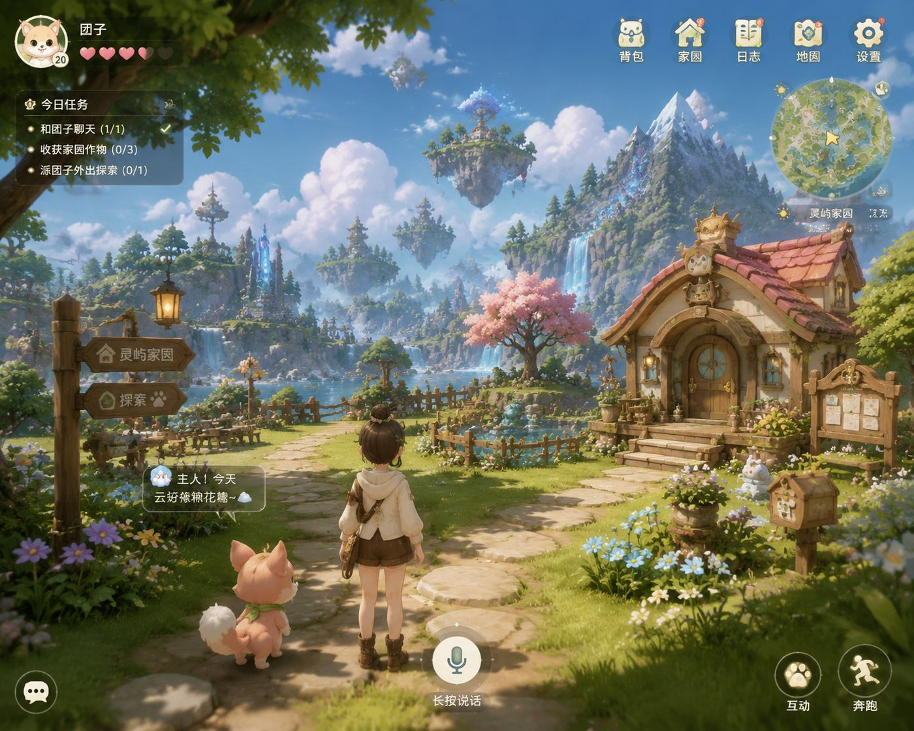
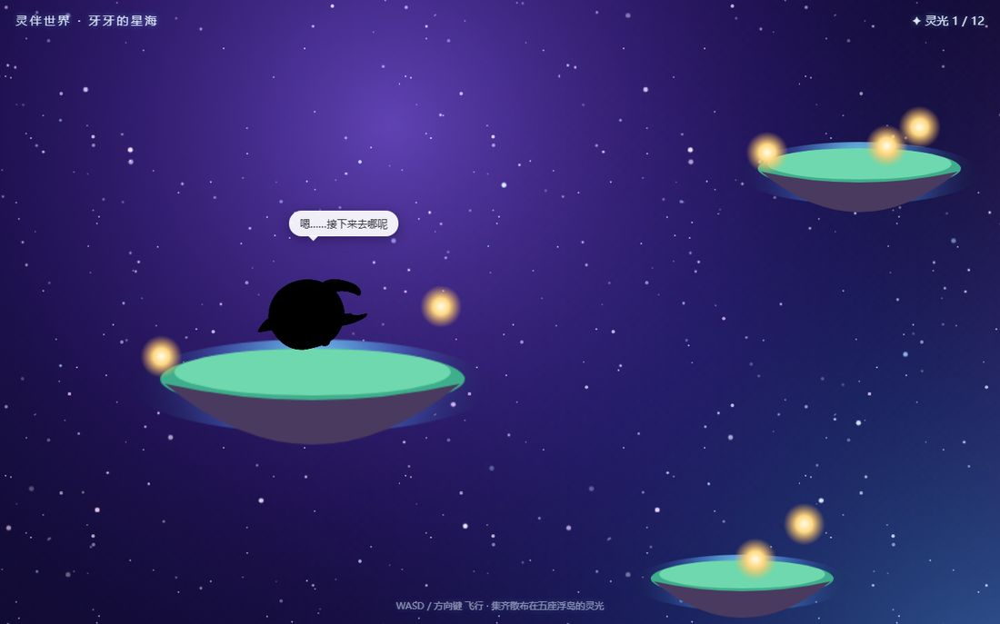
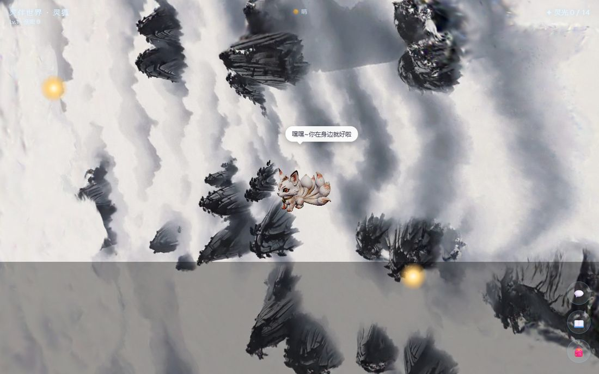
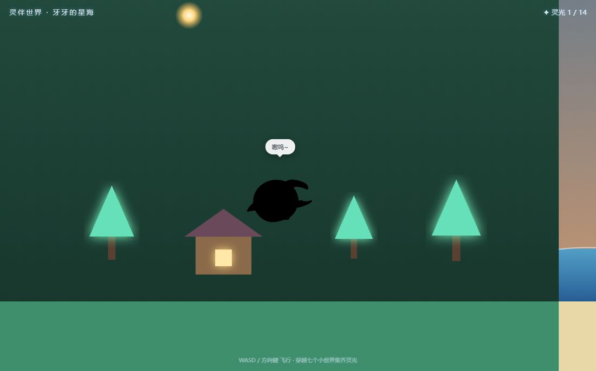
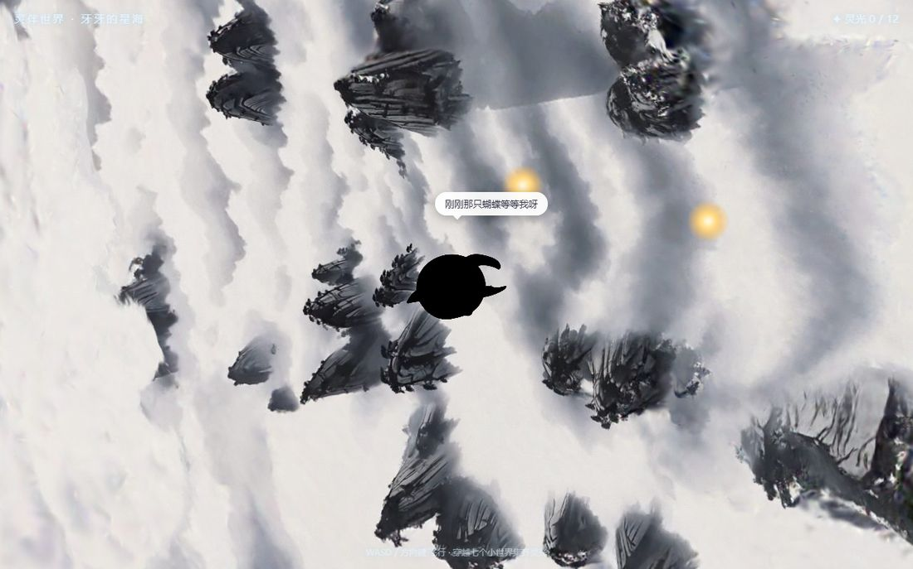
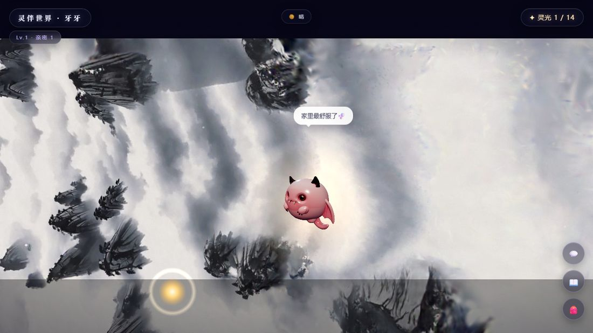
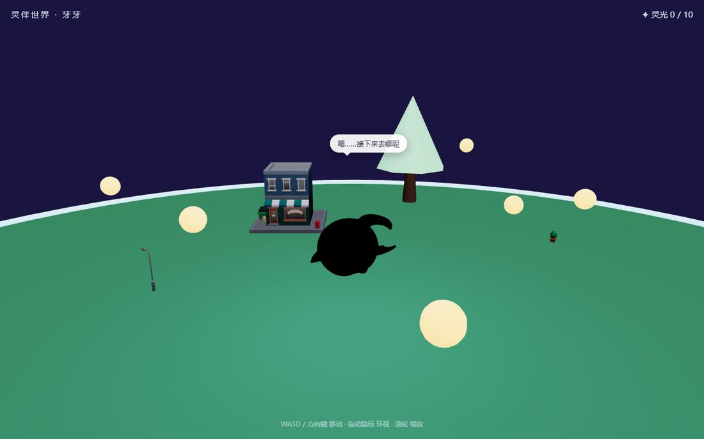

# 灵伴世界（LingPal World）

**AI 宠物 × 3D 探索世界 × 实体盲盒** —— 买一只实体宠物，它在你的 3D 世界里活过来，会听你说话，也会对你说心里话。

本仓库聚合「灵伴世界」的完整开发资产：网页版 2D 小世界（Phaser 3）、3D 太空演示（three.js + 高斯泼溅）、Cocos Creator 3D 工程、微信小游戏原型，以及配套的本地服务器、素材与工具链。其中 `web2d/`、`web/`、`assets/`、`tools/`、`vendor/` 来自 lingpal-world 工作区，已整体并入本仓库。



## 快速开始

需要 Python 3.9+，无需安装依赖即可启动（`flask` 需已安装）：

```bash
python server.py
```

然后打开：

| 页面 | 地址 |
|---|---|
| 2D 小世界（主游戏） | http://localhost:8080/web2d/ |
| 宠物展示（视频） | http://localhost:8080/web2d/showcase.html |
| 3D 太空演示 | http://localhost:8080/web/ |
| 盲盒扫码页 | http://localhost:8080/web2d/qrcodes.html |

仓库内置演示页：打开根目录 `index.html`（手机壳 Demo），点状态栏「🎮 网页游戏」即可直接进入 2D 小世界游戏。

> 2D 小世界支持 `?pet=<id>` 直接指定宠物，例如 `web2d/?pet=yaya`。

## 仓库结构

```
├─ web2d/           # 2D 小世界主游戏（Phaser 3 横卷版，7 大区域 + AI 灵魂引擎）
├─ web/             # 3D 太空演示与离线渲染页（three.js + 高斯泼溅）
├─ assets/          # 宠物 GLB / 2D 精灵 / SPZ 世界 / 二维码 / 2D 背景
│  ├─ pets/         #   原版高精度宠物 GLB（yaya.glb）
│  ├─ 2d/           #   512×512 透明精灵图 + 6 个世界的 2D 预渲染背景
│  ├─ qr/           #   8 只宠物的防伪激活二维码
│  ├─ worlds/       #   6 个真实扫描 SPZ 场景（高斯泼溅点云）
│  └─ kits/         #   KayKit 城市素材（CC0）
├─ tools/           # 生成/验证脚本（二维码、精灵图、截图、前端自检）
├─ vendor/          # 第三方素材包（KayKit City）
├─ cocos-project/   # Cocos Creator 3.8.5 3D 世界正式工程（TypeScript）
├─ wechatgame/      # 微信小游戏可玩原型（零依赖原生 WebGL）
├─ images/          # 世界布局参考图 + README 截图
└─ server.py        # 本地服务器：静态托管 + 防伪激活 + 云存档
```

## Web 2D 小世界（web2d/）

浏览器直接可玩的横版探索游戏，核心玩法围绕「陪伴感」设计：



- **7 大区域横卷地图**：灵屿 → 海滩 → 森林 → 山谷 → 雪山 → 遗迹 → 云端，每区 2 颗灵光，共 14 颗
- **八只宠物灵魂引擎**（`ai.js`）：每只宠物有独立性格标签（勇气/好奇/社交/慵懒/话痨）、口头禅、喜好与恐惧，气泡台词与日记由性格参数驱动，可无缝切换真 LLM（设置 `window.YAYA_LLM`）
- **聊天 / 手账 / 派遣**：聊天攒亲密值；手账自动生成当日小记；派遣宠物出门探险，带回故事
- **区域互动点**：钓鱼、听雨、喊话、泡温泉、挖掘、摘星尘（带冷却）
- **天气、等级与背包**：等级门槛解锁区域，天气随机变化
- **本地记忆 + 云存档**：记忆存 localStorage，在线时同步到 `/api/save`、`/api/load`
- **触屏摇杆 + 键盘**：WASD 移动，触屏虚拟摇杆，边界碰撞







## 宠物展示页（web2d/showcase.html）

游戏内点 🎬 按钮进入「宠物展示」页，播放 3 段宠物展示视频（MiniMax AI 生成，1170×1080）。展示视频属于本地资源（`assets/videos/v1~v3.mp4`），**未随仓库上传**；在本地运行 `python server.py` 后即可正常播放，仓库内页面会显示对应提示。



## Web 3D 演示（web/）

基于 three.js + 高斯泼溅（`@mkkellogg/gaussian-splats-3d`）的太空自由飞行 Demo：加载原版高精度宠物 GLB（`assets/pets/yaya.glb`）与 KayKit 城市素材，星空、星云、光球收集、想法气泡一应俱全。

操作：WASD 飞行 · Space / Shift 升降 · 拖动鼠标环视 · 滚轮缩放。





`web/render_pet.html` 与 `web/render_world.html` 是离线渲染页，供 `tools/` 批量生成宠物精灵图与世界背景图。

## 本地服务器（server.py）

Flask 单文件服务器，承担三类职责：

| 路由 | 说明 |
|---|---|
| `/` + 静态文件 | 托管整个工作区，默认入口 `web2d/index.html` |
| `POST /api/activate` | 防伪激活：HMAC-SHA256 签名校验二维码（`宠物.序列号.签名`），一码一设备 |
| `POST /api/save` / `GET /api/load` | 云存档（SQLite，按设备+宠物维度） |
| `POST /api/reset` | 演示用：清空激活记录（需密钥） |

## 资源（assets/）

- **宠物模型**：8 只宠物 GLB（牙牙/胖达/猫头鹰/龙/灵狐/鲸鱼/章鱼/貔貅），2D 版预渲染为 512×512 透明精灵图
- **SPZ 世界**：6 个真实扫描场景（约 16~31 MB 每个），由 2D 版按机位预渲染为背景图，3D 版可运行时加载
- **二维码**：8 只宠物各一张防伪激活码，配 `tools/make_qr.py` 重新生成


> 原始高精度宠物模型位于 `assets/pets/src/`（68~87 MB/个，共约 735 MB），属本地素材，未随仓库上传；需要入库时建议改用 Git LFS 托管。

## 工具（tools/）

| 脚本 | 用途 |
|---|---|
| `make_qr.py` | 生成带 HMAC 签名的宠物激活二维码 |
| `render_pet_sprite.py` | 用 Playwright 把宠物 GLB 批量预渲染为透明精灵图 |
| `shot.py` / `shot_world.py` | 网页 demo 截图 / SPZ 场景多机位 2D 背景图 |
| `stl_to_glb.py` | STL → GLB 转换 |
| `verify_frontend.py` | 前端自检：加载 / 移动 / 边界 / 收集 / 摇杆 / 无 JS 异常 |

## Cocos Creator 3D 工程（cocos-project/）

Cocos Creator 3.8.5 + TypeScript 正式工程：分块世界（ChunkManager，LRU 上限 25）、8 方向 A\* 寻路、2.5D 等距相机、插件式功能模块（`FeatureRegistry` + `feature_flags.json`）、性能自适应（PerfGrader / PlatformAdapter / ObjectPool）。宠物模型为 7 只 GLB（更新为原版高精度模型），世界布局按「中心灵屿村 + 6 个扇形生态区」配置（`world_layout.json`）。

## 微信小游戏原型（wechatgame/）

零依赖原生 WebGL 的可玩原型：程序化环形岛（中心村 + 6 扇形区 + 海岸水面）、2.5D 相机、虚拟摇杆 + 点按寻路、小地图与三档性能降级；`content/` 存放 7 物种元数据、预置台词包与数据校验器，`config/feature_flags.js` 控制行为/对话/语音/情绪/记忆/手账等模块开关。

## 分支与整合

- `master`：主分支，包含完整平台（Go 服务端、微信小程序、Cocos 工程、部署与文档）
- `3d-world`：3D 世界开发分支（本仓库网页版内容的主要承载分支），已整合进 `master`
- 本次整合采用非破坏性合并：master 原有内容全部保留，3D 世界网页版内容（web2d / web / assets / tools / vendor / server.py 与更新后的 GLB）并入 master

## 第三方资产

- KayKit City Builder Bits（`vendor/kaykit-city.zip`）：CC0 免费素材
- three.js / Phaser 3 / 高斯泼溅库：经 CDN 引入，版权归各自作者
- 宠物展示视频：MiniMax AI 生成，本地资源未上传

## 免责声明

`server.py` 内置的 `SECRET` 仅供本地演示，上线前必须更换为环境变量注入的正式密钥。
